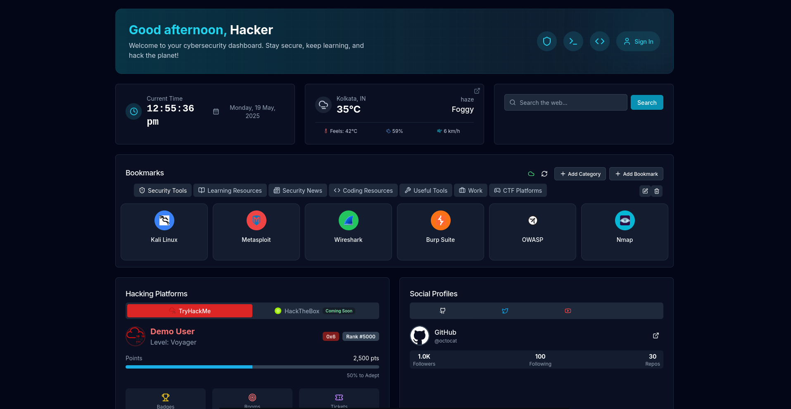

# Cybersecurity Dashboard Frontend

A modern, feature-rich dashboard for cybersecurity professionals, built with Next.js, React, and Tailwind CSS.

# Preview Image


## 🚀 Tech Stack

- **Framework**: [Next.js 15](https://nextjs.org/) with React 19
- **Styling**: [Tailwind CSS](https://tailwindcss.com/) with custom component library
- **UI Components**: Custom components built on [Radix UI](https://www.radix-ui.com/)
- **Animations**: [Framer Motion](https://www.framer.com/motion/)
- **Forms**: [React Hook Form](https://react-hook-form.com/) with [Zod](https://github.com/colinhacks/zod) validation
- **Charts & Data Visualization**: [Recharts](https://recharts.org/)
- **Icons**: [Lucide](https://lucide.dev/) and [Tabler Icons](https://tabler-icons.io/)
- **Notifications**: [Sonner](https://github.com/emilkowalski/sonner)
- **Date Handling**: [date-fns](https://date-fns.org/)
- **Data Fetching**: [SWR](https://swr.vercel.app/)

## ✨ Features

- **Modern User Interface**: Sleek, responsive dashboard with dark mode
- **Authentication System**: Full login/signup flow with JWT token management
- **Widget Dashboard**: Customizable widgets including:
  - Clock and Calendar
  - Weather
  - Quick Notes
  - Search
  - Terminal Emulator
- **Cybersecurity Tools**:
  - Hacking Platforms Integration
  - Challenge Tracking
  - Team Collaboration
- **Social Features**:
  - User Profiles
  - Team Management
  - Events and Challenges
- **Resource Management**:
  - Bookmarks System
  - Documentation Access
  - Learning Resources

## 🛠️ Project Structure

- `/app`: Next.js App Router pages and layouts
- `/components`: Reusable UI components
  - `/ui`: Base UI components (buttons, cards, dialogs, etc.)
  - `/widgets`: Dashboard widget components
  - `/hacking`: Cybersecurity-specific components
  - `/profile`: User profile components
  - `/social`: Social feature components
  - `/bookmarks`: Bookmark management components
- `/contexts`: React Context providers (Auth, etc.)
- `/hooks`: Custom React hooks
- `/lib`: Utility functions and API helpers
- `/public`: Static assets
- `/styles`: Global CSS and Tailwind configuration
- `/types`: TypeScript type definitions

## 🚀 Getting Started

### Prerequisites

- Node.js 18+ 
- pnpm (recommended) or npm/Yarn

### Installation

1. Clone the repository
2. Install dependencies:
   ```bash
   pnpm install
   ```

3. Set up environment variables:
   Move .env.example to `.env` file with:
   ```
   mv .env.example .env
   ```
4. Change the Backend API URL and openweatherapi key

5. Start the development server:
   ```bash
   pnpm dev
   ```

6. Open [http://localhost:3000](http://localhost:3000) in your browser

## 🔧 Available Scripts

- `pnpm dev`: Start development server
- `pnpm build`: Build for production
- `pnpm static`: Build the app as static files in the 'out' directory
- `pnpm serve`: Serve the static build locally
- `pnpm start`: Run production build
- `pnpm lint`: Run ESLint

## 📦 Static Export

This application supports static site generation (SSG), allowing you to deploy it to any static hosting service:

1. Build the static site:
   ```bash
   pnpm static
   ```

2. The static files will be generated in the `out` directory.

3. You can test the static build locally:
   ```bash
   pnpm serve
   ```

4. Deploy the contents of the `out` directory to any static hosting service (Netlify, Vercel, GitHub Pages, etc.).

## 🤝 Contributing

Contributions are welcome! Please feel free to submit a Pull Request.

## 📝 License

This project is licensed under the MIT License - see the LICENSE file for details. 
